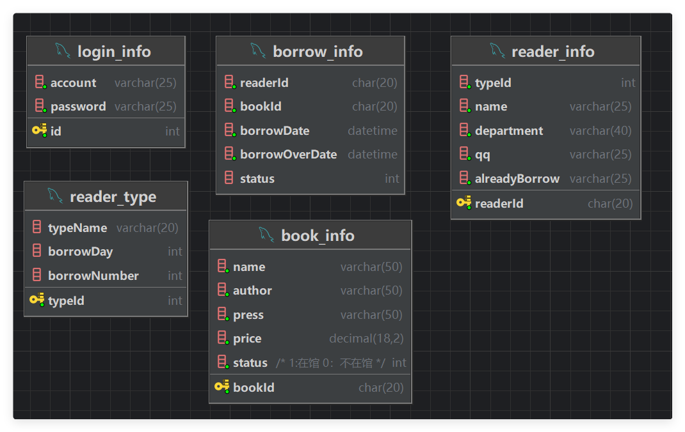
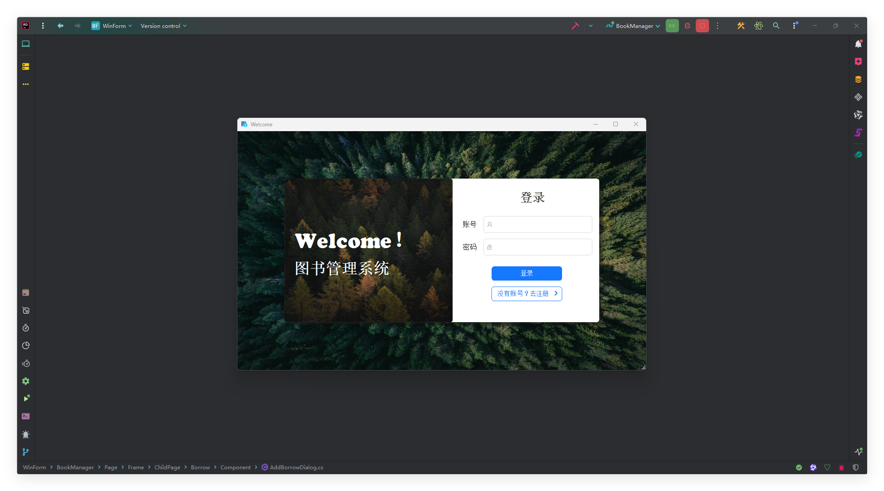
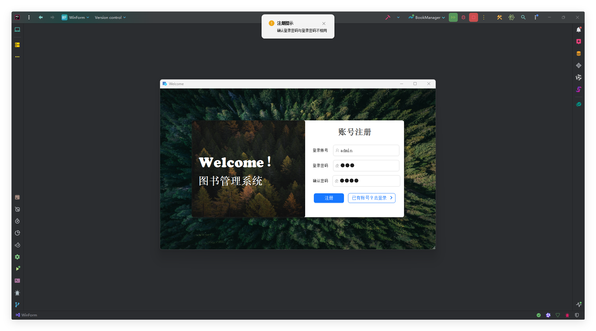
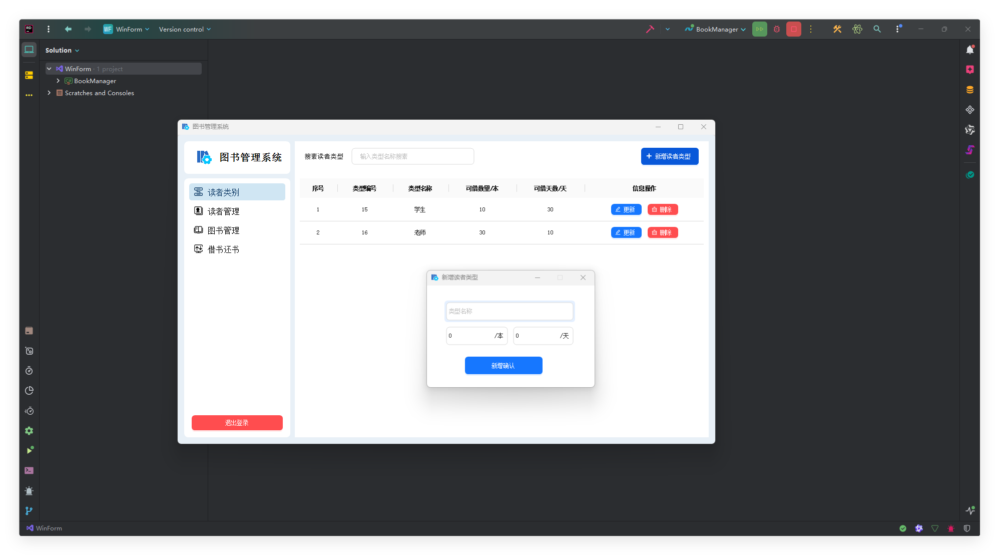
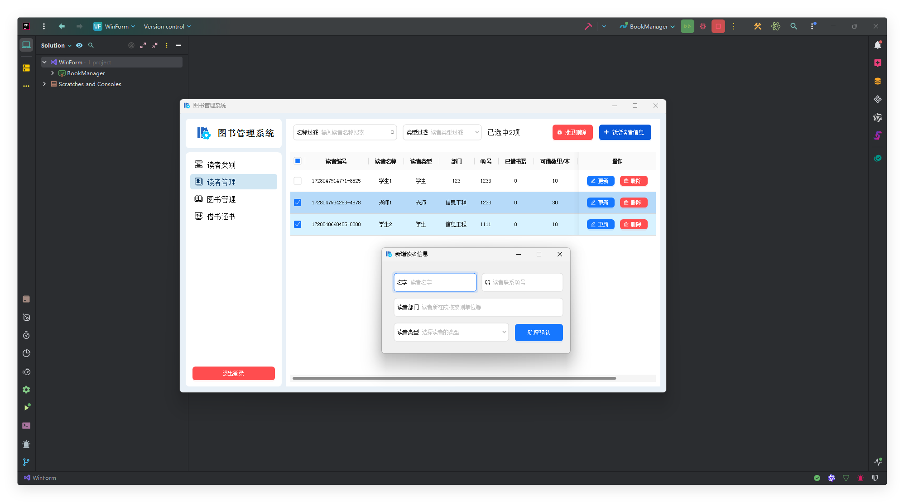
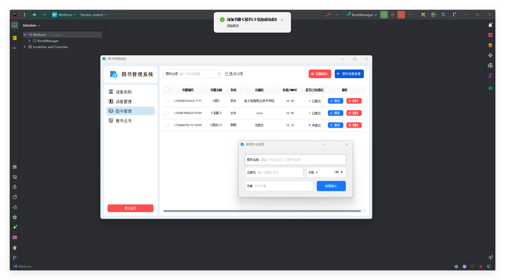
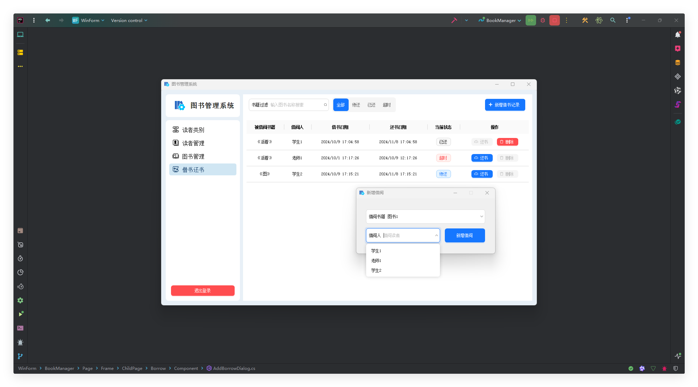

- [图书管理平台](#图书管理平台)
  - [项目架构](#项目架构)
  - [如何使用](#如何使用)
    - [1.配置数据库信息](#1配置数据库信息)
    - [2.创建数据库表](#2创建数据库表)
    - [3.UI库下载](#3ui库下载)
  - [程序截图](#程序截图)
  - [注意事项](#注意事项)


# 图书管理平台

## 项目架构

- 框架：WinForm
- 数据库：SQLServer
- Framework：4.7.2(Core不支持设计窗口的使用😅😭)
- C#：8.0
- UI库：[Antd](https://gitee.com/antdui/AntdUI)

## 如何使用

### 1.配置数据库信息
找到BookManager/Model/AppConstant.cs文件中的DbConfig来修改数据库连接信息
```C#
public class AppConstant
    {
         //连接信息
        private static class DbConfig
        {
            public const string ConnectUrl = "数据库地址";
            public const string DataBase = "数据库名称";
            public const string ConnectAct = "连接账号";
            public const string ConnectPwd = "连接密码";
        }

        public static string UpdateBtnTag = "updateBtn";
        public static string DeleteBtnTag = "deleteBtn";
       //连接信息拼接
        public static string SqlServerConnectInfo = $"Server={DbConfig.ConnectUrl};Database={DbConfig.DataBase};User Id={DbConfig.ConnectAct};Password={DbConfig.ConnectPwd};";
    }
```

### 2.创建数据库表
**SQLServer开发的时候用的是2022，没用啥特殊特性，没有版本要求**

>表的创建导出在`Table.sql`中 如果运行不了自行按照表结构图创建吧，这个sql也是idea导出的😎 


### 3.UI库下载
如果构建没有自动下载Antd包，请自行下载，使用的是1.6.2版本 **(推荐使用NuGet下载)**

## 程序截图













## 注意事项

- 项目没有用户管理模块:

因为我是按照我们教科书的最后一章的主要要求做的,那里面就没有这个要求😅,所以压根没做，可以自行fork把它加上🤖🤖🤖

- 后续也大概率不会维护:

不要提issues，可自行fork下去改，因为上面说了，这是学校教的课，避免期末做这个大作业所以来提前做下，所以就当是练手的demo

